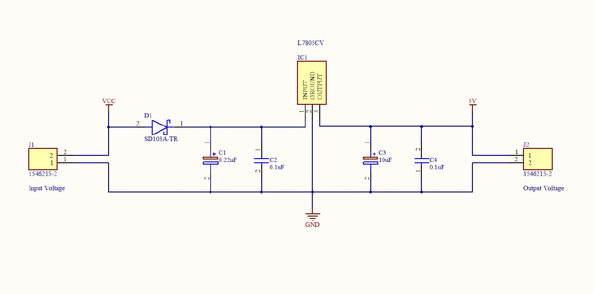
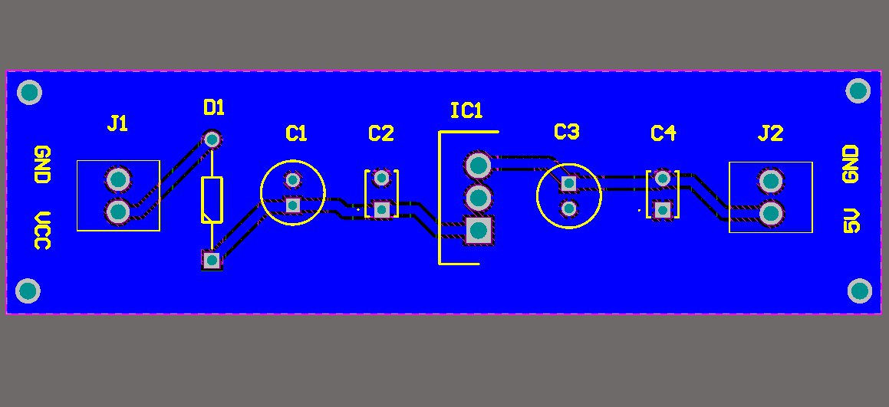
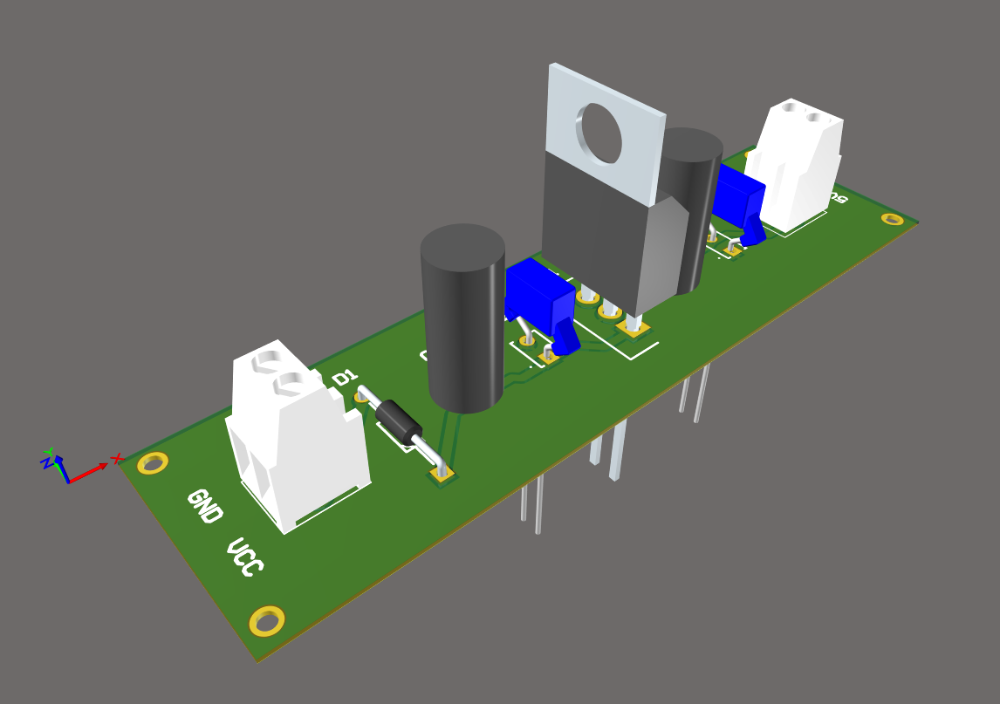
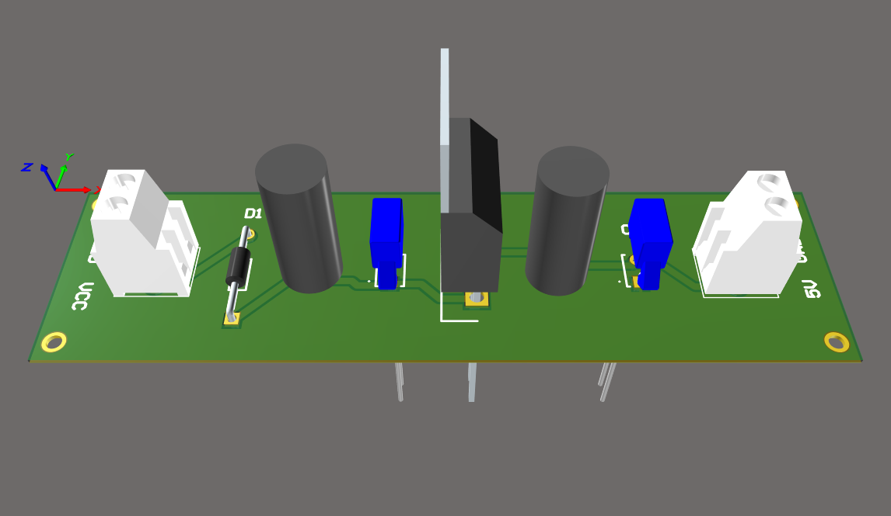

# Fuente de Alimentación Regulada de 5V en Altium

Este repositorio contiene los archivos de diseño para una fuente de alimentación regulada de **5V** basada en el circuito integrado **LM7805**. El proyecto fue desarrollado íntegramente en **Altium Designer** y es una solución robusta y confiable para alimentar tus prototipos electrónicos, microcontroladores y otros dispositivos digitales.

## 📝 Descripción del Proyecto

El diseño de este módulo se centra en la simplicidad y la fiabilidad. Utiliza el conocido regulador lineal **LM7805** para convertir una tensión de entrada no regulada en una salida estable de 5V. El circuito está optimizado para proporcionar una corriente de salida constante, lo que lo hace ideal para aplicaciones de baja potencia donde se necesita un suministro de energía seguro y sin fluctuaciones. El repositorio incluye el esquemático y el diseño de la PCB, facilitando la fabricación del módulo.

### Características Clave

* **Regulador LM7805:** Proporciona una salida de voltaje fijo de 5V.
* **Diseño en Altium Designer:** Incluye archivos de esquemático (`.SchDoc`) y PCB (`.PcbDoc`).
* **Ideal para Prototipos:** Perfecto para usar en breadboards o para integrar en proyectos más grandes.
* **Componentes:** Mezcla de componentes THT y SMD para una configuración versátil.

---

## ⚙️ Lista de Componentes

A continuación, se presenta la lista detallada de los componentes necesarios para construir este proyecto.

| Designator | Comment | Description | Footprint | Quantity |
| :--- | :--- | :--- | :--- | :--- |
| C1 | 0.22uF | Capacitor Polarised | CAPPRD200W52D500H1250 | 1 |
| C2, C4 | 0.1uF | Capacitor | RDER71E104K0P1H03B | 2 |
| C3 | 10uF | Capacitor Polarised | CAPPRD200W55D500H1250 | 1 |
| D1 | SD103A-TR | Schottky Diode | DIOAD950W60L350D150 | 1 |
| IC1 | LZ7805CV | Integrated Circuit | TO255P460X1020X2008-3P | 1 |
| J1, J2 | 1546215-2 | Connector | 15462152 | 2 |

---

## 📸 Imágenes del Proyecto

### 1. Esquema Eléctrico

### 2. PCB

### 3. Vista Ortogonal

### 4. Vista Superior

---

## 🚀 Cómo usar este repositorio

1.  **Clona el repositorio:** `git clone https://github.com/ingwplanchez/altium-power-supply.git`
2.  **Abre el proyecto en Altium Designer:** Navega a la carpeta del proyecto y abre el archivo `.PrjPcb`.
3.  **Visualiza y modifica:** Explora el esquemático y la PCB. Si lo deseas, puedes generar los archivos de fabricación (Gerber) para producir tu propia placa.